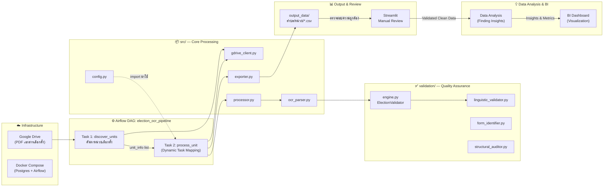
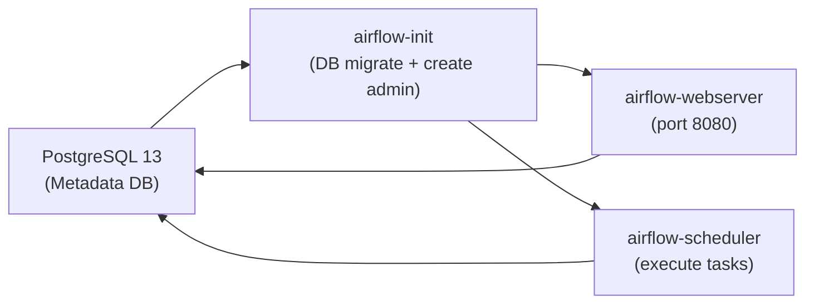
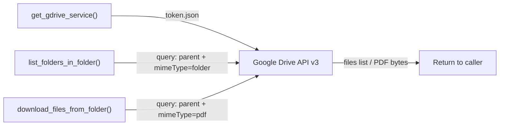
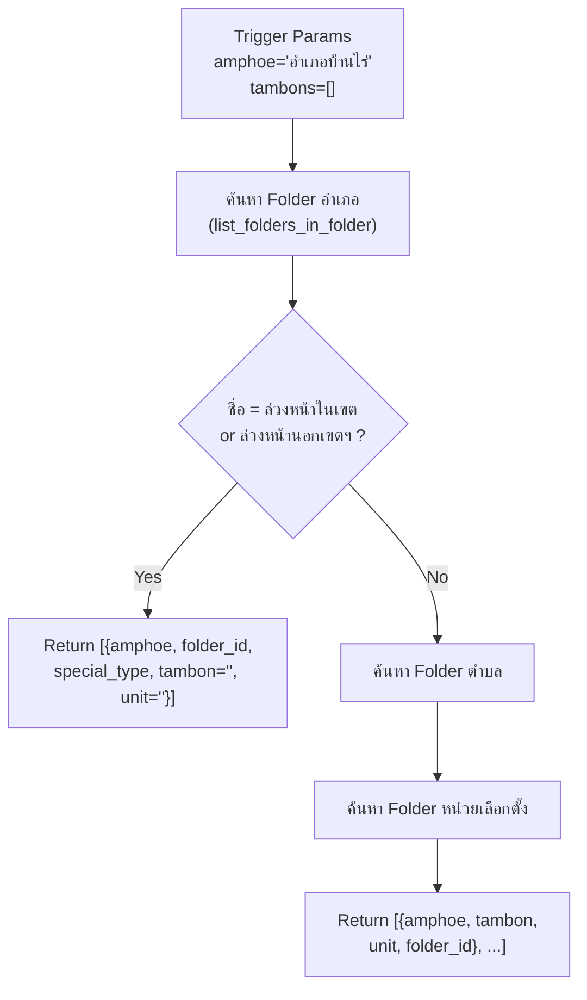
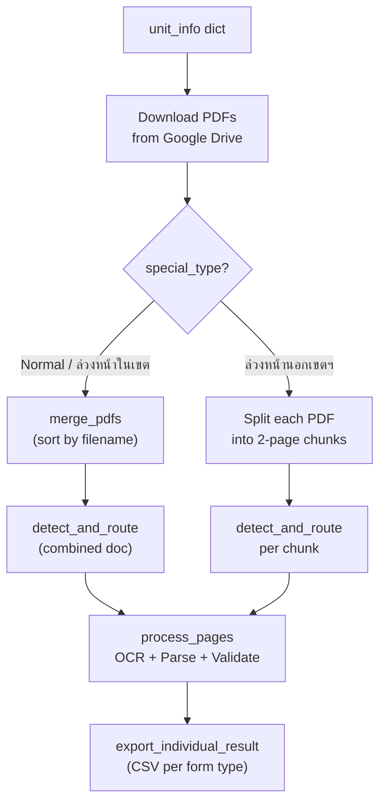

# 📋 Election OCR Pipeline — คู่มืออธิบายระบบฉบับสมบูรณ์ (Part 1/2)

> **Project**: `election_pipeline` — ระบบ OCR อัตโนมัติสำหรับแปลงเอกสาร PDF ผลการเลือกตั้ง (ส.ส.) จาก Google Drive ให้เป็นข้อมูล CSV ที่ผ่านการ Validate แล้ว  
> **Orchestrator**: Apache Airflow 2.8 บน Docker  
> **OCR Engine**: Typhoon OCR (OpenAI-compatible API)

---

## 🏗️ Pipeline Overview Flow



---

## 📁 Project Structure

```
election_pipeline/
├── .env                          # API Keys + Google Drive Folder ID
├── Dockerfile                    # Airflow 2.8 + Python 3.11 image
├── docker-compose.yml            # Postgres + Webserver + Scheduler
├── auth_setup.py                 # One-time Google OAuth setup script
├── requirements.txt              # Python dependencies
├── pyproject.toml                # Project metadata (uv/pip)
│
├── credentials/
│   ├── client_secret.json        # Google OAuth Client ID
│   └── token.json                # Auto-generated OAuth token
│
├── src/                          # Core pipeline code
│   ├── config.py                 # Master lists + output paths
│   ├── gdrive_client.py          # Google Drive API wrapper
│   ├── processor.py              # PDF merge, table detect, OCR
│   ├── ocr_parser.py             # Markdown/HTML → structured dict
│   └── exporter.py               # Dict → CSV/JSON files
│
├── dags/
│   └── election_dag.py           # Airflow DAG definition (2 tasks)
│
├── validation/                   # Quality assurance module
│   ├── engine.py                 # Jigsaw Validator (fuzzy match + flags)
│   ├── linguistic_validator.py   # Thai numeral ↔ word cross-check
│   ├── form_identifier.py        # Regex-based form type classifier
│   ├── structural_auditor.py     # Completeness checker
│   ├── notebooks/
│   │   ├── manual_review_queue.ipynb   # Jupyter manual correction
│   │   └── streamlit_manual_review.py  # Streamlit review dashboard
│   └── tests/                    # Unit + integration tests
│       ├── formatters.py         # NaN serialization helpers (test-only)
│       ├── test_jigsaw.py
│       ├── test_linguistic_validator.py
│       ├── test_structural.py
│       └── test_integration.py
│
├── output_data/                  # Pipeline output (auto-created)
└── corr_output_data/             # Manually corrected data
```

---

## Part 1: Infrastructure & Data Ingestion

### 1.1 `.env` — Environment Variables

| Variable | Purpose |
|---|---|
| `TYPHOON_OCR_API_KEY` | API key สำหรับ Typhoon OCR service |
| `GDRIVE_ROOT_FOLDER_ID` | Root folder ID ของ Google Drive ที่เก็บ PDF |
| `RATE_LIMIT` | `true`/`false` — จำกัดความเร็ว OCR calls |

### 1.2 `Dockerfile` — Custom Airflow Image

- **Base**: `apache/airflow:2.8.1-python3.11`
- **OS deps**: `gcc`, `python3-dev`, `libgl1`, `libglib2.0-0` (สำหรับ OpenCV/PyMuPDF)
- **Python deps**: ติดตั้งจาก `requirements.txt`

> **เหตุผล**: ใช้ Official Airflow image เพื่อความเสถียร และเพิ่ม native libs สำหรับ image processing

### 1.3 `docker-compose.yml` — Service Orchestration



**Key Config**:
- `LocalExecutor` — ไม่ต้องใช้ Celery/Redis สำหรับ single-machine
- Volume mounts: `dags/`, `src/`, `credentials/`, `output_data/`, `validation/`
- `PYTHONPATH: /opt/airflow` — ให้ import `src.*` และ `validation.*` ได้

### 1.4 `auth_setup.py` — Google OAuth First-Time Setup

| | |
|---|---|
| **Input** | `credentials/client_secret.json` (Google OAuth client) |
| **Process** | เปิด browser popup ให้ user กด "อนุญาต" |
| **Output** | `credentials/token.json` (refresh token) |

> **เหตุผล**: ต้อง authenticate ครั้งเดียวก่อนรันบน Airflow เพราะ Airflow container ไม่มี browser

### 1.5 `src/config.py` — Master Configuration

**Input**: `.env` file + hardcoded constants  
**Output**: Global constants ใช้ทั่วทั้ง pipeline

| Constant | Type | Description |
|---|---|---|
| `GDRIVE_ROOT_FOLDER_ID` | `str` | Google Drive root folder ID |
| `MASTER_CANDIDATES` | `List[str]` | 5 ผู้สมัคร ส.ส. แบ่งเขต (ชื่อเต็มรวมคำนำหน้า) |
| `MASTER_PARTIES` | `List[str]` | 56 พรรคการเมือง สำหรับบัญชีรายชื่อ |
| `BASE_OUTPUT_DIR` | `Path` | `/opt/airflow/output_data` (Docker) หรือ `output_data` (local) |

> **เหตุผล**: Master lists ใช้เป็น ground truth สำหรับ fuzzy matching — ชื่อจาก OCR อาจมี typo จึงต้องมี canonical list เทียบ

### 1.6 `src/gdrive_client.py` — Google Drive API Client



**Functions**:

| Function | Input | Output |
|---|---|---|
| `get_gdrive_service()` | `credentials/token.json` | Google Drive service object |
| `list_folders_in_folder(service, parent_id, name?)` | parent folder ID, optional name filter | `List[{id, name}]` |
| `download_files_from_folder(service, folder_id, dir)` | folder ID, local download dir | `List[str]` (file paths) |

> **เหตุผล**: ใช้ `contains` query สำหรับชื่อโฟลเดอร์ เพราะ user อาจพิมพ์แค่ "บ้านไร่" แทน "อำเภอบ้านไร่"

---

## Part 2: Airflow DAG — Task Orchestration

### 2.1 `dags/election_dag.py` — Main Pipeline Orchestrator

**DAG Config**:
- `schedule_interval=None` (manual trigger only)
- `execution_timeout=300s` per task
- Params: `amphoe` (str), `tambons` (list, optional)

#### Task 1: `discover_units` — ค้นหาหน่วยเลือกตั้ง



**Output**: `List[dict]` — แต่ละ dict = 1 หน่วยเลือกตั้งที่ต้อง process

**Google Drive Folder Structure**:
```
Root/
├── อำเภอบ้านไร่/
│   ├── ตำบลคอกควาย/
│   │   ├── หน่วยที่ 1/   ← มี PDF files
│   │   ├── หน่วยที่ 2/
│   │   └── ...
│   ├── ตำบลบ้านไร่/
│   └── ...
├── ล่วงหน้าในเขต/        ← Special case (ไม่มี tambon/unit)
└── ล่วงหน้านอกเขตฯ/      ← Special case (split per 2 pages)
```

#### Task 2: `process_unit` — OCR + Parse + Validate (Dynamic Task Mapping)

ใช้ `.expand(unit_info=units_list)` สร้าง parallel tasks ตามจำนวนหน่วย

**Concurrency**: `max_active_tis_per_dag` = 5 (ปกติ) หรือ 1 (rate limit mode)




---

*ดู Part 2 สำหรับรายละเอียดของ Processing Layer, Validation Layer, Data Schema, และ Manual Review Tools*
