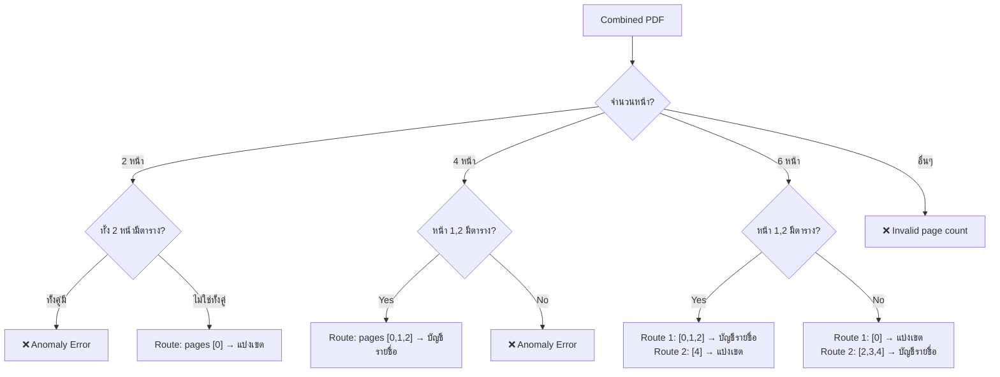
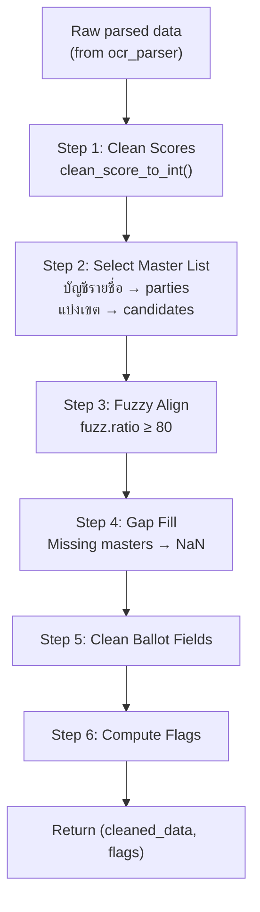
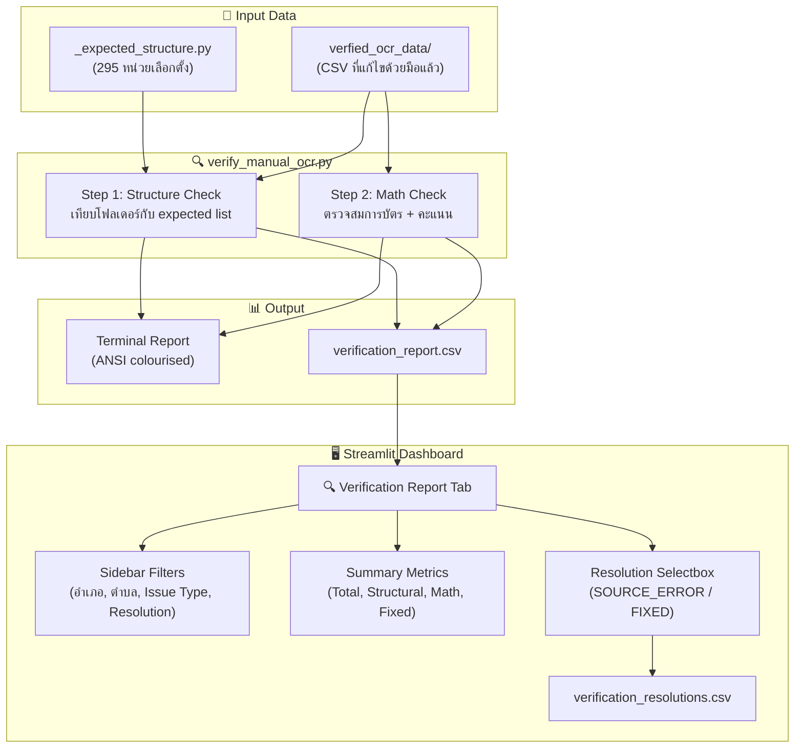
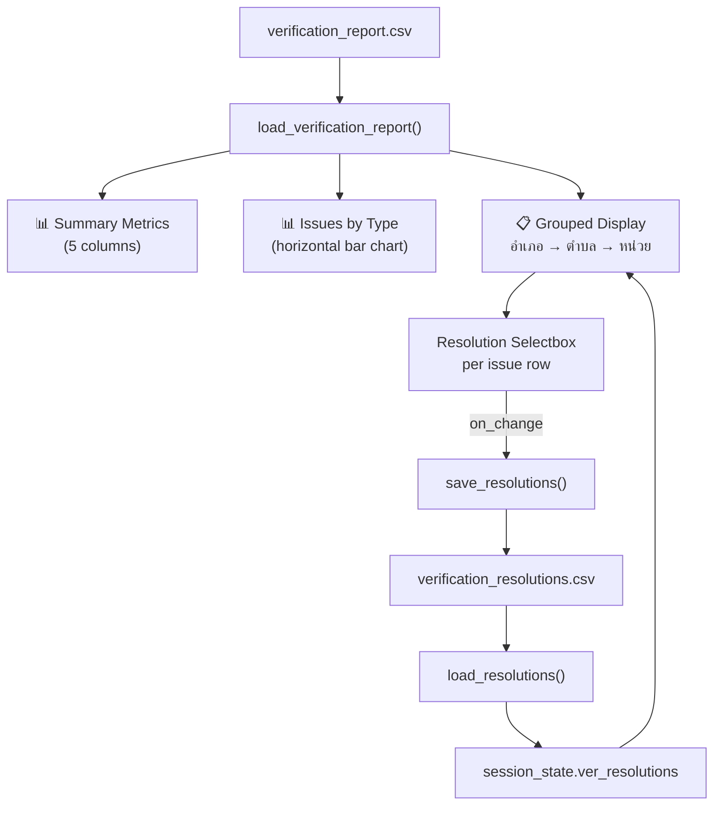

# 📋 Election OCR Pipeline — Part 2/2: Processing, Validation & Output

---

## Part 3: Core Processing Layer (`src/`)

### 3.1 `src/processor.py` — PDF → OCR Text

หัวใจหลักของ pipeline — แปลง PDF pages เป็น text ผ่าน Typhoon OCR

#### Function: `has_table(page, threshold=15)`

| | |
|---|---|
| **Input** | PyMuPDF page object |
| **Process** | Render→grayscale→binary threshold→morphological ops เพื่อหาเส้นแนวนอน+แนวตั้ง |
| **Output** | `bool` — True ถ้ามีเส้นรวมกัน > threshold |

> **เหตุผล**: ใช้ Computer Vision แทน text-based detection เพราะ OCR ยังไม่ได้ทำ ต้องดูจากภาพก่อนว่าหน้าไหนมีตาราง

#### Function: `merge_pdfs(pdf_paths)`

| | |
|---|---|
| **Input** | `List[str]` — paths ของ PDF files |
| **Process** | Sort by filename → merge ทุกไฟล์เป็น 1 document |
| **Output** | `fitz.Document` — combined PDF |

> **เหตุผล**: แต่ละหน่วยอาจมีหลาย PDF file ต้องรวมก่อนเพื่อให้ detect_and_route ทำงานถูกต้อง

#### Function: `detect_and_route(doc)` — Routing Logic

ตรวจจับว่าเอกสารมีฟอร์มอะไรบ้าง โดยดูจาก **จำนวนหน้า** + **มีตารางหรือไม่**



**Routing Rules**:
- **2 หน้า** = ฟอร์มแบ่งเขตเท่านั้น (หน้า data + หน้าลายเซ็น)
- **4 หน้า** = ฟอร์มบัญชีรายชื่อเท่านั้น (3 หน้าตาราง + 1 หน้าลายเซ็น)
- **6 หน้า** = ทั้ง 2 ฟอร์ม (ลำดับขึ้นกับว่าตารางอยู่ต้นหรือท้าย)

> **เหตุผล**: ใช้ heuristic จากโครงสร้างจริงของเอกสาร กกต. — ฟอร์ม ส.ส. 5/18 (แบ่งเขต) มี 2 หน้า, ส.ส. 5/18 (บช) มี 4 หน้า

#### Function: `process_pages()` — OCR Execution

| | |
|---|---|
| **Input** | `doc`, `page_indices`, `file_type`, `parser`, master lists |
| **Output** | `(cleaned_data, flags_data)` |

**Processing Strategy by Form Type**:

| Form Type | Strategy | เหตุผล |
|---|---|---|
| **แบ่งเขต** | ตัดรูปครึ่งบน+ครึ่งล่าง → OCR แยก | ป้องกัน timeout เพราะรูปใหญ่ |
| **บัญชีรายชื่อ** | ส่งทั้งหน้า (ลดเป็นขาวดำ) | ตารางยาว ตัดครึ่งจะเสียข้อมูล |

**Error Handling**:
- Retry 3 ครั้งต่อ OCR call (timeout/API error)
- `_OCR_CALL_TIMEOUT = 80s` per call via ThreadPoolExecutor
- AirflowTaskTimeout จะ propagate ทันทีไม่ retry
- ถ้า timeout ครบ 3 ครั้ง → skip chunk + set `flag_ocr_timeout`

**Image Preprocessing**: แปลงเป็น grayscale + JPEG quality=75 เพื่อลดขนาดก่อนส่ง API

### 3.2 `src/ocr_parser.py` — Text → Structured Data

แปลง OCR text (Markdown/HTML) ให้เป็น Python dict

#### `parse_markdown(markdown_text, form_type)`

**Input**: Raw OCR text (Markdown format)  
**Output**: Structured dict

**Extraction Logic**:

| Field | Regex Pattern | ตัวอย่าง Match |
|---|---|---|
| `eligible_voters` | `ผู้มีสิทธิเลือกตั้ง.*?จำนวน\s*([\d,๑-๙]+)` | "จำนวน 1,200" |
| `voters_showed_up` | `มาแสดงตน.*?จำนวน\s*([\d,๑-๙]+)` | "จำนวน 800" |
| `ballots_allocated` | `ได้รับจัดสรร.*?จำนวน\s*([\d,๑-๙]+)` | "จำนวน 810" |
| `ballots_used` | `บัตรเลือกตั้งที่ใช้.*?จำนวน\s*([\d,๑-๙]+)` | "จำนวน 800" |
| `valid_ballots` | `บัตรดี.*?จำนวน\s*([\d,๑-๙]+)` | "จำนวน 750" |
| `invalid_ballots` | `บัตรเสีย.*?จำนวน\s*([\d,๑-๙]+)` | "จำนวน 30" |
| `no_vote_ballots` | `ไม่เลือก.*?จำนวน\s*([\d,๑-๙]+)` | "จำนวน 20" |
| `ballots_remaining` | `บัตรเลือกตั้งที่เหลือ.*?จำนวน\s*([\d,๑-๙]+)` | "จำนวน 10" |

**Score Table Parsing** (2 strategies):

1. **HTML `<tr>/<td>`**: ค้นหา `<tr>` tags → extract cells → map name→score
2. **Markdown `|...|`**: parse pipe-delimited rows → filter header/separator → map

**บัญชีรายชื่อ Special Case**: ถ้ามี 4 columns จะรวม col3+col4 เป็น score (เช่น `"177"` + `"(หนึ่งร้อยเจ็ดสิบเจ็ด)"`)

### 3.3 `src/exporter.py` — Data → Files

| Function | Input | Output |
|---|---|---|
| `export_individual_result()` | data dict, amphoe/tambon/unit, filename | CSV file at `output_data/ตำบล/หน่วย/summary_*.csv` |

**Folder Structure**: `output_data/{ตำบล}/{หน่วย}/summary_{form_type}.csv`

> **เหตุผล**: ใช้ `pd.json_normalize` เพื่อ flatten nested dict (เช่น `scores.พรรคA`) ให้เป็น flat CSV columns

---

## Part 4: Validation Layer (`validation/`)

### 4.1 `validation/engine.py` — Jigsaw Validation Engine



#### Fuzzy Name Alignment (`_align_to_master`)

- ใช้ `thefuzz.fuzz.ratio` เปรียบเทียบชื่อ OCR กับ master list
- Threshold: **80** — ถ้า ratio ≥ 80 จะ remap เป็นชื่อ canonical
- ถ้า < 80 → เก็บชื่อเดิม + flag เป็น `unrecognised`
- ถ้าหลาย OCR rows map ไปที่ master เดียวกัน → **รวมคะแนน**

> **เหตุผล**: OCR มักอ่านชื่อไทยผิดเล็กน้อย (เช่น สระหาย, พยัญชนะสลับ) fuzzy matching ช่วยจับคู่ได้โดยไม่ต้อง exact match

#### Flag Computation (`_compute_flags`)

| Flag | Condition | Detail |
|---|---|---|
| `flag_missing_data` | มี score หรือ ballot field ใดเป็น NaN | — |
| `flag_math_total_used` | `valid + invalid + no_vote ≠ ballots_used` | แสดง expected vs actual |
| `flag_math_valid_score` | `sum(all scores) ≠ valid_ballots` | แสดง sum vs expected |
| `flag_name_mismatch` | มีชื่อที่ fuzzy match ไม่ได้ | list ชื่อที่ไม่รู้จัก |
| `flag_linguistic_mismatch` | ตัวเลข ≠ ตัวอักษรไทย (cross-check) | list ชื่อที่ mismatch |

### 4.2 `validation/linguistic_validator.py` — Thai Numeral Cross-Check

**Core Functions**:

| Function | Input | Output | Purpose |
|---|---|---|---|
| `normalize_numerals(s)` | `"๑๗๗"` | `"177"` | แปลงเลขไทย→อารบิก |
| `clean_score_to_int(s)` | `"1,234"` / `"-"` / `None` | `1234` / `NaN` | Normalize + parse เป็น int |
| `thai_word_to_int(s)` | `"หนึ่งร้อยเจ็ดสิบเจ็ด"` | `177` | ใช้ PyThaiNLP แปลงคำไทย→ตัวเลข |
| `validate_score(num, word)` | `"177"`, `"หนึ่งร้อยหกสิบ"` | `{flag: True, value: NaN}` | Cross-check ตัวเลข vs คำ |

**Missing-Data Sentinels** → `NaN`: `None`, `""`, `"-"`, `"—"`, `"."`

> **เหตุผล**: เอกสาร กกต. มักมีทั้งตัวเลขและตัวอักษร (เช่น "177 (หนึ่งร้อยเจ็ดสิบเจ็ด)") — ถ้าทั้ง 2 อ่านได้แต่ไม่ตรงกัน แสดงว่า OCR ผิดอย่างน้อย 1 ตัว

### 4.3 `validation/form_identifier.py` — Form Type Classifier

| Pattern | Match | Type |
|---|---|---|
| `ส.ส.\s*5\s*/\s*(11\|18)\s*\(บช\)` | `ส.ส. 5/18 (บช)` | **Party List** |
| `ส.ส.\s*5\s*/\s*(11\|18)(?!\s*\(บช\))` | `ส.ส. 5/18` | **Constituency** |
| (ไม่ match) | — | **Unknown** |

> **เหตุผล**: Party List regex ต้องเช็คก่อน (specific กว่า) เพราะ Constituency pattern จะ match text ที่มี (บช) ด้วยถ้าไม่มี negative lookahead

### 4.4 `validation/structural_auditor.py` — Completeness Checker

> ตรวจสอบว่าผลลัพธ์จาก OCR ของแต่ละหน่วยเลือกตั้งนั้น มีทั้ง **ฟอร์มบัญชีรายชื่อ (Party List)** และ **ฟอร์มแบ่งเขต (Constituency)** ครบทั้งคู่หรือไม่ — ถ้าขาดฟอร์มใดฟอร์มหนึ่งจะถูก flag ไว้

| Function | Input | Output |
|---|---|---|
| `audit_units(records)` | List of `{Tambon, Unit, form_type}` | List of `{Tambon, Unit, missing_form}` |
| `generate_missing_report(items, path)` | missing items + output path | CSV file |

**Logic**: ทุก (Tambon, Unit) ต้องมีทั้ง Constituency **และ** Party List — ถ้าขาดจะถูก report

### 4.5 `validation/tests/formatters.py` — Serialization Helpers (Test-Only Utility)

> [!NOTE]
> ไฟล์นี้ **ไม่ได้ถูกใช้ใน pipeline จริง** — ถูก import เฉพาะใน `test_jigsaw.py` เท่านั้น ใช้สำหรับ research/testing ตอนพัฒนา เพื่อดูว่า NaN ถูก serialize อย่างไรในแต่ละ format
>
> ไฟล์นี้ถูกย้ายมาไว้ที่ `validation/tests/` แล้ว เพราะเป็น test utility ไม่ใช่ production code — ช่วยให้โครงสร้างโปรเจกต์ชัดเจนขึ้นว่าอะไรคือ pipeline จริง vs อะไรคือเครื่องมือ dev/test

| Function | NaN Handling | Use Case |
|---|---|---|
| `prepare_df_for_csv(df)` | NaN → `"MISSING"` | CSV export ให้เห็นชัดว่าข้อมูลหาย |
| `prepare_data_for_json(data)` | NaN → `None` (JSON `null`) | JSON export ที่ valid ตาม spec |

---

## Part 5: Output Data Schema

### 5.1 Individual Unit CSV (`summary_แบ่งเขต.csv` / `summary_บัญชีรายชื่อ.csv`)

| Field | Type | Description |
|---|---|---|
| `metadata.amphoe` | str | ชื่ออำเภอ |
| `metadata.tambon` | str | ชื่อตำบล |
| `metadata.unit` | str | ชื่อหน่วยเลือกตั้ง |
| `metadata.file` | str | ชื่อไฟล์ output |
| `eligible_voters` | int/NaN | จำนวนผู้มีสิทธิ |
| `voters_showed_up` | int/NaN | จำนวนผู้มาใช้สิทธิ |
| `ballots_allocated` | int/NaN | จำนวนบัตรที่ได้รับ |
| `ballots_used` | int/NaN | จำนวนบัตรที่ใช้ |
| `valid_ballots` | int/NaN | บัตรดี |
| `invalid_ballots` | int/NaN | บัตรเสีย |
| `no_vote_ballots` | int/NaN | บัตรไม่เลือกผู้สมัครใด |
| `ballots_remaining` | int/NaN | บัตรเหลือ |
| `scores.{name}` | int/NaN | คะแนนของผู้สมัคร/พรรค (1 column ต่อ 1 ชื่อ) |
| `flag_*` | bool | Validation flags (6 types) |
| `flag_*_detail` | str | รายละเอียดของ flag |


## Part 6: Manual Review Tools

เครื่องมือสำหรับตรวจสอบและแก้ไขข้อมูล OCR ด้วยมือ ประกอบด้วย 3 ส่วนหลัก:

1. **`verify_manual_ocr.py`** — CLI script ตรวจสอบ structure + math ของ CSV ที่แก้ไขแล้ว
2. **`streamlit_manual_review.py`** — Web dashboard แสดง Verification Report + ติดตาม resolution
3. **`manual_review_queue.ipynb`** — Jupyter Notebook (legacy) สำหรับตรวจ flag จาก master log



---

### 6.1 `verify_manual_ocr.py` — CLI Verification Script

**Run**: `python election_pipeline/validation/verify_manual_ocr.py`

สคริปต์หลักสำหรับตรวจสอบความถูกต้องของ CSV ใน `verfied_ocr_data/` ทำงาน 2 ขั้นตอน:

#### Step 1: Structure Check — ตรวจความครบถ้วนของโฟลเดอร์ + ไฟล์

| Check | Logic | Issue Type |
|---|---|---|
| **โฟลเดอร์หาย** | เทียบ `EXPECTED_UNITS` (295 หน่วย) กับ `verfied_ocr_data/` — ถ้าหน่วยใดไม่มีโฟลเดอร์ | `MISSING_FOLDER` |
| **CSV ไม่ครบ** | แต่ละโฟลเดอร์ปกติต้องมี `summary_แบ่งเขต.csv` **และ** `summary_บัญชีรายชื่อ.csv` | `MISSING_CSV` |

> [!NOTE]
> โฟลเดอร์ "ล่วงหน้าในเขต" และ "ล่วงหน้านอกเขตฯ" ถูก **ข้ามการตรวจ 2-file rule** เพราะมีโครงสร้างพิเศษ (ไม่มี tambon/unit sub-directory)

**Expected Structure Source**: `_expected_structure.py` — ไฟล์ hardcode ค่า `EXPECTED_UNITS` เป็น set ของ tuple `(amphoe, tambon, unit)` ทั้ง 295 หน่วย เพื่อไม่ต้องพึ่ง `raw_pdf/` folder จริง

#### Step 2: Math Check — ตรวจสมการบัตรเลือกตั้ง + คะแนน

สำหรับ **ทุก CSV** ใน `verfied_ocr_data/` จะตรวจ 3 สมการ:

| # | สมการ | Issue Type | ตัวอย่าง Detail |
|---|---|---|---|
| 1 | `ballots_allocated = ballots_used + ballots_remaining` | `MATH_ALLOCATION` | `ballots_allocated (810) ≠ ballots_used (800) + ballots_remaining (9) = 809` |
| 2 | `ballots_used = valid_ballots + invalid_ballots + no_vote_ballots` | `MATH_USED` | `ballots_used (800) ≠ valid (750) + invalid (30) + no_vote (19) = 799` |
| 3 | `sum(scores.*) = valid_ballots` | `MATH_SCORES` | `sum(scores) (745) ≠ valid_ballots (750)` |

ถ้า field ใดหายไป (NaN) จะ report เป็น `MATH_MISSING_FIELD` แทน

นอกจากนี้ยังตรวจ **Metadata Mismatch** — เปรียบเทียบค่า `metadata.amphoe`, `metadata.tambon`, `metadata.unit` ใน CSV กับชื่อโฟลเดอร์ที่ไฟล์อยู่ ถ้าไม่ตรงกันจะ report เป็น `METADATA_MISMATCH`

#### Output Files

| Output | Path | รายละเอียด |
|---|---|---|
| **Terminal report** | stdout | ANSI colourised, แบ่ง section Structure / Math / Summary |
| **CSV report** | `output_data/verification_report.csv` | ทุก issue ใน format: `amphoe, tambon, unit, file_type, issue_type, issue_details` |

---

### 6.2 Streamlit Dashboard (`streamlit_manual_review.py`)

**Run**: `streamlit run validation/notebooks/streamlit_manual_review.py`

Web dashboard สำหรับ browse และ resolve issues จาก `verification_report.csv`

> [!NOTE]
> Tab "Manual Review Queue" (ที่เคยอ่านจาก `master_summary_log.csv`) ถูก **comment out** แล้ว เนื่องจาก master log ถูกลบออกจาก pipeline — ปัจจุบันเหลือแค่ Tab "Verification Report"

#### Tab: 🔍 Verification Report



**Summary Metrics** (แถบด้านบน):

| Metric | คำอธิบาย |
|---|---|
| Total Issues | จำนวน issue ทั้งหมด |
| 🏗️ Structural | `MISSING_FOLDER` + `MISSING_CSV` + `READ_ERROR` |
| 🔢 Math | ที่เหลือทั้งหมด (MATH_*) |
| ⚛️ Source Errors | issue ที่ถูก resolve เป็น `SOURCE_ERROR` |
| ✅ Fixed | issue ที่ถูก resolve เป็น `FIXED` |

**Sidebar Filters**:

| Filter | Options | Behaviour |
|---|---|---|
| อำเภอ (Amphoe) | multiselect จากข้อมูลจริง | กรองตาม amphoe, tambon cascade ตาม amphoe ที่เลือก |
| ตำบล (Tambon) | multiselect (cascade จาก amphoe) | กรองตาม tambon |
| Issue Type | multiselect + label mapping | เช่น `MATH_SCORES` → "🔢 Math: Scores" |
| File Type | multiselect | `summary_แบ่งเขต`, `summary_บัญชีรายชื่อ` |
| Resolution | multiselect | `— Not reviewed —`, `SOURCE_ERROR`, `FIXED` |
| Hide resolved | checkbox | ซ่อน issue ที่ resolve แล้ว |

**Grouped Display** — แสดงข้อมูลตาม hierarchy:

```
▸ อำเภอบ้านไร่ — 12 issue(s) · 5 unreviewed     ← expander (เปิดอัตโนมัติถ้ามี unreviewed)
  ▸ ตำบลคอกควาย — 4 issue(s) · 2 unreviewed      ← nested expander
      หน่วยเลือกตั้ง หน่วยที่ 1
        🔢 Math: Scores  `summary_แบ่งเขต`         ← issue label + file type
        sum(scores) (745) ≠ valid_ballots (750)     ← issue details
        [Resolution ▼ — Not reviewed —]             ← selectbox per issue
```

**Resolution Workflow**:

| Resolution | Emoji | ความหมาย |
|---|---|---|
| `— Not reviewed —` | — | ยังไม่ได้ตรวจ |
| `SOURCE_ERROR` | ⚛️ | ข้อมูลต้นทางผิด แก้ไม่ได้ |
| `FIXED` | ✅ | แก้ไขแล้ว |

ทุกครั้งที่เปลี่ยน resolution จะ **auto-save** ลงไฟล์ `output_data/verification_resolutions.csv` ทันที ผ่าน `on_change` callback — ไม่ต้องกดปุ่ม save แยก

**ไฟล์ที่เกี่ยวข้อง**:

| File | Read/Write | คำอธิบาย |
|---|---|---|
| `output_data/verification_report.csv` | Read | ผลจาก `verify_manual_ocr.py` |
| `output_data/verification_resolutions.csv` | Read + Write | เก็บ resolution ที่ user เลือก (key → resolution) |
| `output_data/reviewed_units.csv` | Read + Write | เก็บ units ที่ mark ว่า reviewed แล้ว (legacy, ใช้กับ Tab 1 ที่ถูก comment out) |

**Dependencies**:

| Library | ใช้ทำอะไร | Fallback |
|---|---|---|
| `plotly` | Bar chart แบบ interactive | ถ้าไม่มี ใช้ `altair`, ถ้าไม่มีทั้งคู่ → raw dataframe |
| `streamlit` | Web UI framework | — (required) |

---

## Part 7: Test Suite

| Test File | Coverage |
|---|---|
| `test_jigsaw.py` | `clean_score_to_int` NaN, math flags, name mismatch, formatters, integration |
| `test_linguistic_validator.py` | 8 dimensions: numeric accuracy, linguistic, mismatch detection, normalization, error propagation, backward compat, structural consistency, pipeline integration |
| `test_structural.py` | `identify_form_type` (10 cases), `audit_units` (6 cases), `generate_missing_report` (2 cases) |
| `test_integration.py` | Parser↔Validator wiring, NaN delegation, end-to-end parse→validate |

---

## Part 8: End-to-End Data Flow Summary


| Stage | Module | Key Technology |
|---|---|---|
| **Ingest** | `gdrive_client.py` | Google Drive API v3, OAuth 2.0 |
| **Merge & Route** | `processor.py` | PyMuPDF, OpenCV morphology |
| **OCR** | `processor.py` | Typhoon OCR (OpenAI client), ThreadPoolExecutor |
| **Parse** | `ocr_parser.py` | Regex, HTML/Markdown table parsing |
| **Validate** | `engine.py` | thefuzz (fuzzy match), numpy NaN |
| **Cross-check** | `linguistic_validator.py` | PyThaiNLP `thaiword_to_num` |
| **Audit** | `structural_auditor.py` | Set-based completeness check |
| **Export** | `exporter.py` | Pandas `json_normalize`, CSV/JSON |
| **Orchestrate** | `election_dag.py` | Airflow 2.8, Dynamic Task Mapping |
| **Review** | `streamlit_manual_review.py` | Streamlit, Plotly/Altair |
